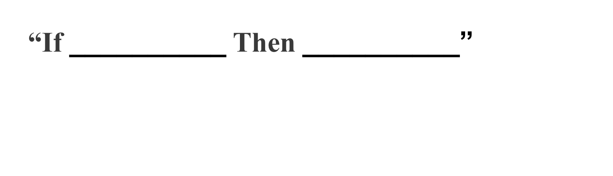

## Event-Driven Automation with StackStorm

###Matt Oswalt
###@Mierdin
###keepingitclassless.net

---

# General Outline

- General Introduction to Event-Driven Automation, and StackStorm
- Overview of Fundamental StackStorm Concepts
- Demo
- Extensibility and Community

---

## What is Event-Driven Automation?

---

# What is StackStorm?

- StackStorm is a platform for integration and automation across services and tools. It ties together your existing infrastructure and application environment so you can more easily automate that environment. It has a particular focus on taking actions in response to events.
- “Event Driven Automation Platform”

---

# What is StackStorm?

---

# What is StackStorm?

---

# How Does StackStorm Enable Event-Driven Automation?

---

---

# StackStorm Components

---

# Installing StackStorm

- One-liner install (NOT FOR PRODUCTION)
  - st2vagrant
- OR, "real" install.
- Docs at https://docs.stackstorm.com/install/index.html

<!--
Single Command Installs StackStorm, WebUI, ChatOps, Mistral
Also sets up Nginx, SSL certificates, st2 Authentication
-->

---

# Installing StackStorm

Can deploy StackStorm with configuration management tools

- Ansible VERY active work going on here
  - https://github.com/StackStorm/ansible-st2
- Chef Cookbook - maintained by community; prod.deployment options
  - https://github.com/StackStorm/chef-stackstorm

---

# StackStorm Concepts

---

# Actions

- The "that" part of "if this then that"
- Defined in YAML
  - May also be accompanied by script or other YAML files

<!-- ---

# Actions

 -->

---

# Actions

<!-- ---

# Actions

 -->

---

# Sensors and Triggers

- The "this" part of "if this then that"
- Sensors gather information about the world
- Triggers let us know when something interesting has happened

---

# Rules

- Ties everything together
- Watches for triggers, executions actions (or workflows)

---

# Workflows

- Allows for more complicated things than simple actions
- Stackstorm uses OpenStack Mistral as primary workflow definition

<!-- 
Now, this is all well and good, but in the real world when remediating problems with infrastructure,
it's rare that we can fix anything meaningfully by calling a single action. Most of the time we have
a bunch of related tasks that need to happen in some sort of predefined way to resolve problems.

This is where workflows come in. -->

---

# Packs

- Atomic unit of extensibility in Stackstorm
- Can contain actions, sensors, rules, workflows, etc.

---

# Demo

---

# Extensibility and Community

- Pack Exchange - https://exchange.stackstorm.org/
- Growing Community - https://stackstorm.com/#community
  - Slack is free to join, and very active

<!-- We just looked at some very simple examples today, just to understand the fundamental concepts. You can apply the same concepts to any of the packs in the exchange.
Look through some of the packs in exchange and see the sensors and actions there -->

---

# Get Started!

- Documentation - https://docs.stackstorm.com/
- Slides, demo, YAML files - https://github.com/mierdin/st2-intro
